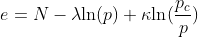
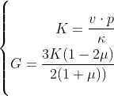

# MCCDataGeneration

- This repository is used to generate the training data for our upcoming physics-constrained neural network training.

## Yield function

## Initial volum 

## Elastic modulus

