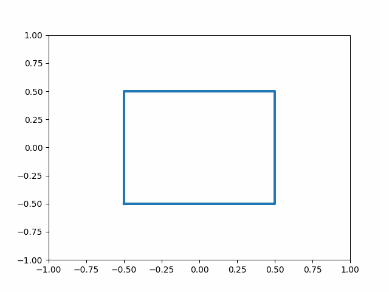

# Data Generation
- This repository is used to generate the training data for our upcoming physics-constrained neural network training.
- Guassian process is involved for random loading path generation.
- There 3 kinds of the elastoplastic model implemented here. 1. the model based on von-mises stress, iso-tropic exponential hardening and associated flow rule, 2. the modified Cam-Clay model, 3. the CSUH model.

## Gaussian process
These are used for random loading path generation.

- kernel function

- Gaussian function

- Covariance Matrix

- Gaussian random loading path

Gaussian random loading path          |  Deformation of the configuration
:-------------------------:|:-------------------------------:
  |  

## MCC model (Modified Cam-Clay model)
### Yield function of the modified Cam-Clay model

### Size of the yield surface controlled by the hardening variable in the yield function

### Initial volum 

### Elastic modulus

### Results of the Modified CamClay
Assuming that the loading will end up in the critical state.

Loading information         |  NCL & CSL
:-------------------------:|:-------------------------------:
 | 

## CSUH model (Critical state unified hardening model)
There model is implemented under the guidance according to the paper (https://www.sciencedirect.com/science/article/pii/S0266352X19300576)

### Resualts of the undrained compression

e_0       |p0 |  Loading results
:-------------------------:|:-------------------------------:
 0.700 | p0=1000kPa| 
 0.747 |  p0=1000kPa| 
 0.794 |  p0=1000kPa| 
 0.841 |  p0=1000kPa| 
 0.888 |  p0=1000kPa| 
 0.935 |  p0=1000kPa| 

e_0     | p0    |  Loading results
:-------------------------:|:-------------------------------:
  0.833 |  p0=100 kPa| 
  0.833 | p0=1000kPa| 
  0.833 | p0=2000kPa| 
  0.833 |  p0=3000kPa| 
